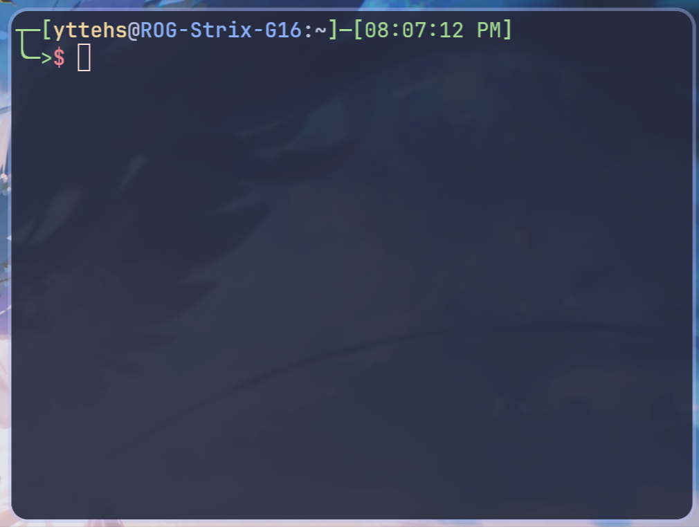

# Command line assignment

## 1. 识别 Prompt

写出你从下面几个命令行 Prompt 中读出的所有信息。

### 1

```bash
[caiyi@archlinux ~]$ git --version
```

你能获取到的信息：

```

```

### 2

```bash
Welcome to fish, the friendly interactive shell
Type help for instructions on how to use fish
caiyi@LAPTOP-I80ETG8J ~> git --version
```

你能获取到的信息：

```

```

### 3



你能获取到的信息：

```

```

### 4


你能获取到的信息：

```

```

### 5

```ascii
Windows PowerShell
Copyright (C) Microsoft Corporation. All rights reserved.

Install the latest PowerShell for new features and improvements! https://aka.ms/PSWindows

PS C:\Users\Caiyi Hsu>
```

你能获取到的信息：

```

```

### 6

```bash
Caiyi Hsu@LAPTOP-I80ETG8J MINGW64 ~
$ git --version
```

你能获取到的信息：

```

```

## 编写命令

根据各题目要求编写命令，将命令储存在指定的文件内。如果题目要求多条指令，则以换行符分隔

所有设计文件的命令，你需要假设文件存在，但你**不能**创建相应的文件。

### 输出当前目录

编写一条 bash 命令，输出当前工作目录

- 储存你的命令在 `where-am-i.sh` 中

### 列举父文件夹项

编写一条 bash 命令，列举**父文件夹**中所有文件夹项

- 储存你的命令在 `list-parent-entries.sh` 中

### 删除文件

使用命令，删除

- 当前文件夹中的 `a.txt`
- `tmp` 文件夹下的 `a.txt`
- 父文件夹内的 `a.txt`

- 储存你的命令在 `remove-files.sh` 中

### 移动文件

使用移动命令，

- 移动父文件夹下的 `a.txt` 到当前文件夹
- 移动当前文件夹下的 `tmp` **文件夹**到 `dir` 文件夹**内**
- 将当前文件夹下的 `b.txt` 重命名为 `c.txt`
- 将 `test` **文件夹**重命名为 `test1` **文件夹**

- 储存你的命令在 `move-files.sh` 中

### 创建文件夹

使用创建文件夹的命令，

- 在当前目录下创建一个空的 `tmp` 文件夹
- 仅使用一条命令，创建连续创建三个嵌套的文件夹 `dir1\dir2\dir3`

- 储存你的命令在 `create-directory.sh` 中

## 填空题

1. 给出一个常用的打印文件内容的命令：____

2. 给出一个常用的创建空文件夹的命令：____

3. 如果我下载了一个 a.out 没有执行权限，你应该输入什么命令：____

4. 在 Shell 中输出 "Hello, world" 的命令：____

## 简答题

我在 ~ 中下载了一套用于 RISCV 的 gcc 工具链，这个工具链有以下文件结构：

```
~
+- riscv-gcc
    +- bin
        |- g++-riscv64
        +- gcc-riscv64
```

我应该如何操作才能在shell中直接使用这些工具链。

提示：利用环境变量

```
在这里简述你的操作
```

## 可选附加作业(自学)

### 1

使用 1 行shell命令，在当前文件夹的 a.txt 中写入 "Hello, "

### 2

使用 1 行shell命令，在上一题的的 a.txt 中追加 "world!"

### 3

同过软链接的方式解决[简答题](#简答题)的内容
